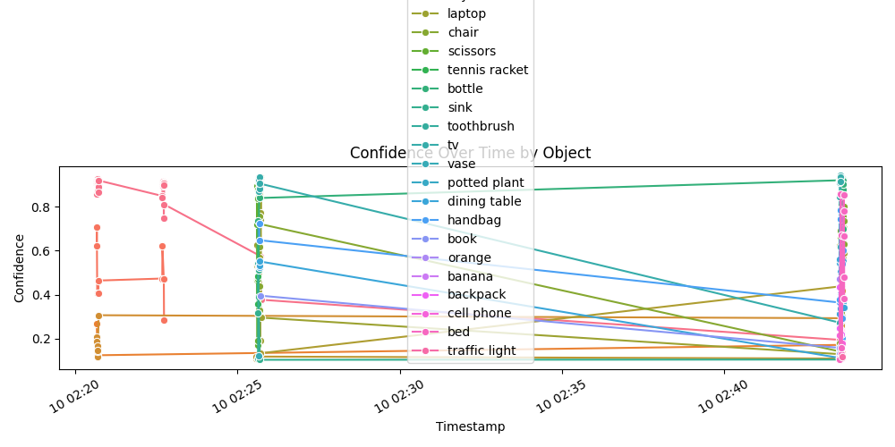
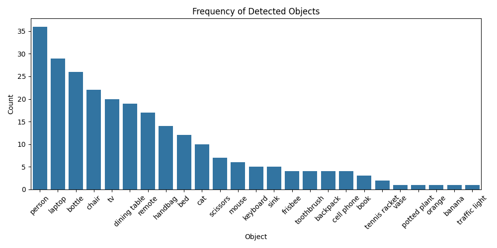
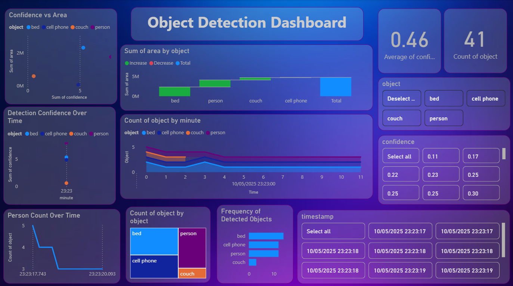

# 🧠 Real-Time Object Detection with YOLOv8, EDA & Power BI Dashboard

This project combines **real-time object detection** using YOLOv8 with automated **exploratory data analysis (EDA)** and a **Power BI dashboard**. It captures video from webcam, detects objects, logs results in SQLite, generates visual reports, and launches an interactive dashboard for insights.

---

## 🚀 Features

- 🎯 Real-time object detection using YOLOv8
- 🧠 Object tracking with ByteTrack
- 📦 SQLite database logging
- 📊 CSV export for Power BI
- 📈 Multi-chart EDA with Matplotlib & Seaborn
- 📎 Power BI dashboard with filters, KPIs & charts
- ⚡ One-click automated end-to-end execution

---

## 📁 Folder Structure

```
Real-time-object-detection/
├── test2.py                    # Main YOLOv8 detection and logging script
├── eda.py                      # EDA + CSV + Power BI launcher
├── Detection_dashoard.pbix     # Power BI dashboard (linked to CSV)
├── detection_data.csv          # CSV output for dashboard (auto-generated)
├── detections.db               # SQLite DB (auto-generated)
├── object_log.csv              # Raw frame-by-frame log (auto-generated)
├── eda_report.pdf              # Visual report (auto-generated)
├── requirements.txt            # Python dependencies
└── README.md                   # Project documentation
```

---

## ⚙️ Requirements

- Python 3.8+
- Power BI Desktop
- Webcam
- YOLOv8 model (e.g., `yolov8s.pt`)

### 📦 Python Libraries

Install required libraries:

```bash
pip install -r requirements.txt
```

### 📥 Download YOLOv8 Model

Download pretrained weights like `yolov8s.pt` from [Ultralytics](https://github.com/ultralytics/ultralytics).

---

## ▶️ How It Works

### 1. **Run the Main Script**

```bash
python test2.py
```

This script will:
- Launch your webcam
- Detect and track objects in real time
- Log detection results to `detections.db` and `object_log.csv`
- On exit, automatically run `eda.py`

### 2. **EDA Script (`eda.py`)**

- Loads detection data from SQLite
- Generates plots (object frequency, confidence trends, area analysis, etc.)
- Saves EDA report to PDF
- Exports data to `detection_data.csv`
- Automatically opens Power BI dashboard




---

## 📊 Dashboard Preview

The Power BI dashboard includes:

- 📊 Object detection frequency bar chart
- 📈 Confidence score trends over time
- 🔘 Confidence vs Area scatter plot
- 👥 Person detection timeline
- 🔍 Filters by object, confidence, and timestamp
- 📦 KPI cards for total detections



---


---

## 👨‍💻 Author

**Siddharth Sagar**  
📧 Email: *[your-siddharthsagar188@gmail.com]*  
🔗 GitHub: [github.com/sidharth188](https://github.com/sidharth188)

---

## 📄 License

This project is open-source under the [MIT License](LICENSE).

> 💡 Feel free to fork, use, and improve this for your own detection + analytics projects!
